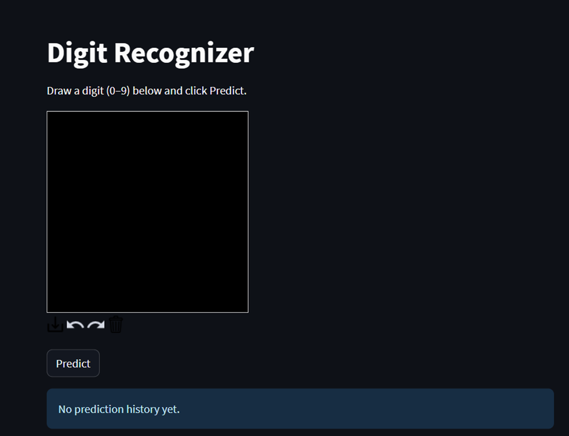
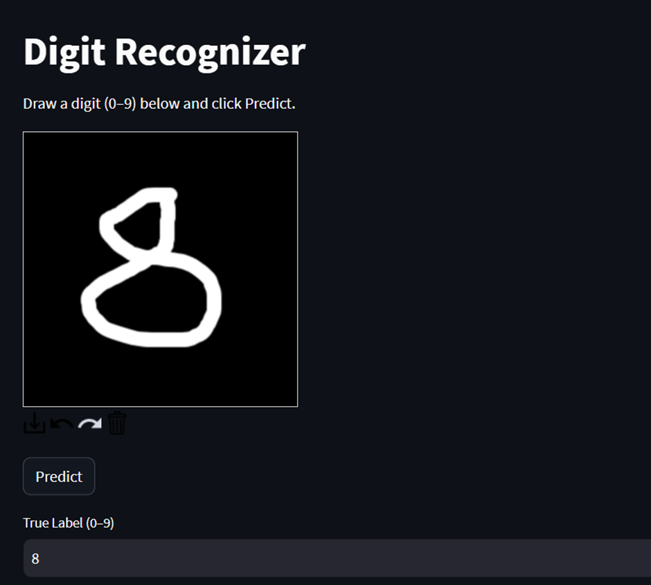
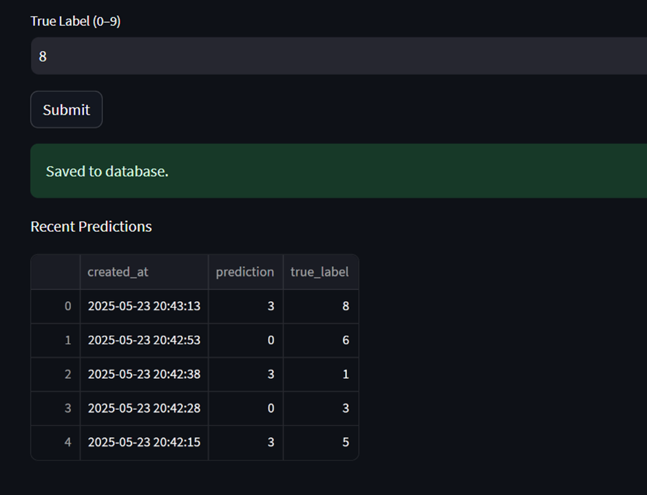

# 🧠 MNIST Digit Recognizer with Streamlit & PyTorch

This is a web application that allows users to draw digits (0–9) on a canvas and receive real-time predictions using a convolutional neural network (CNN) trained on the MNIST dataset.

🔗 **Live Demo:** [https://mnist-streamlit-docker.onrender.com](https://mnist-streamlit-docker.onrender.com)

---

## 📸 Demo Preview





---

## 🔍 Features

- ✏️ Interactive drawing canvas powered by Streamlit
- 🔮 Real-time digit prediction using a PyTorch CNN model (97% accuracy)
- 💾 Logging of each prediction (including confidence score and timestamp) to a PostgreSQL database
- 🐳 Easily deployable with Docker

---

## 🛠 Technologies Used

- **Python 3.10**
- **Streamlit** – Frontend interface
- **PyTorch** – CNN model for digit recognition
- **PostgreSQL** – Logging prediction data (`prediction`, `confidence`, `created_at`, `image_data`)
- **Docker & Docker Compose** – Deployment and isolation
- **Render** – Cloud hosting

---

## 🧠 Model Details

The model is a simple convolutional neural network (CNN) trained with PyTorch on the MNIST dataset.

- Input: 28x28 grayscale image
- Accuracy: ~97% on test set
- Output: Softmax probabilities for digits 0–9

---

## 🧪 How to Run Locally with Docker

```bash
# Clone the repository
git clone https://github.com/Kadriye/mnist-streamlit-docker.git
cd mnist-streamlit-docker

# Build and run with Docker Compose
docker-compose up --build
```

Once running, visit `http://localhost:8501` in your browser.

---

## 🗃 Database Schema (PostgreSQL)

| Column       | Type        | Description                         |
|--------------|-------------|-------------------------------------|
| `id`         | SERIAL      | Primary key                         |
| `prediction` | INTEGER     | Model's predicted digit             |
| `confidence` | FLOAT       | Confidence score                    |
| `true_label` | INTEGER     | Ground truth label (optional)       |
| `image_data` | BYTEA       | PNG-encoded drawing                 |
| `created_at` | TIMESTAMP   | Log timestamp                       |

---

## 👤 Author

Developed by **Kadriye Türkcan**

GitHub: [@Kadriye](https://github.com/Kadriye)

---

## 📄 License

This project is open-source and licensed under the [MIT License](LICENSE).
